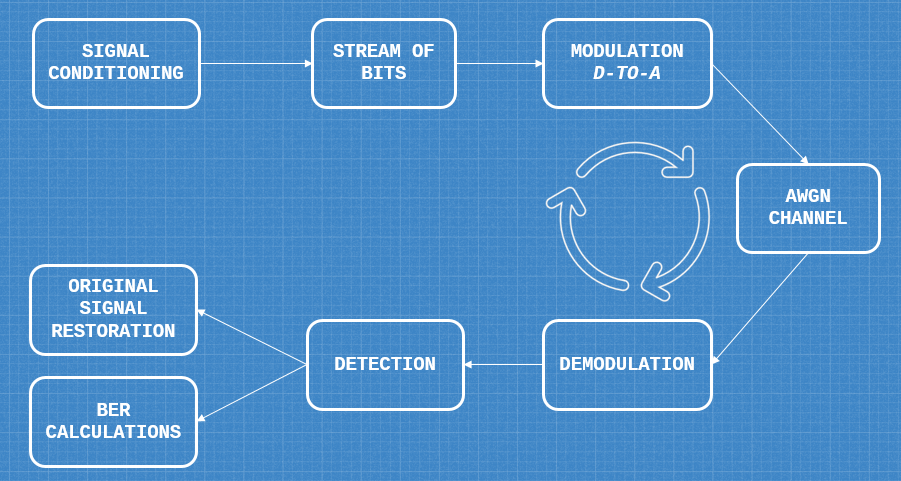
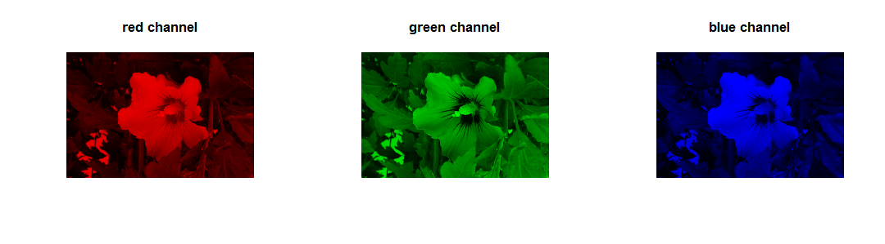
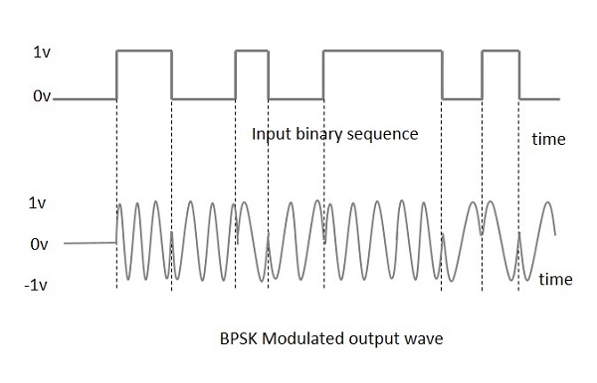
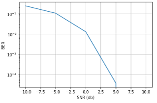
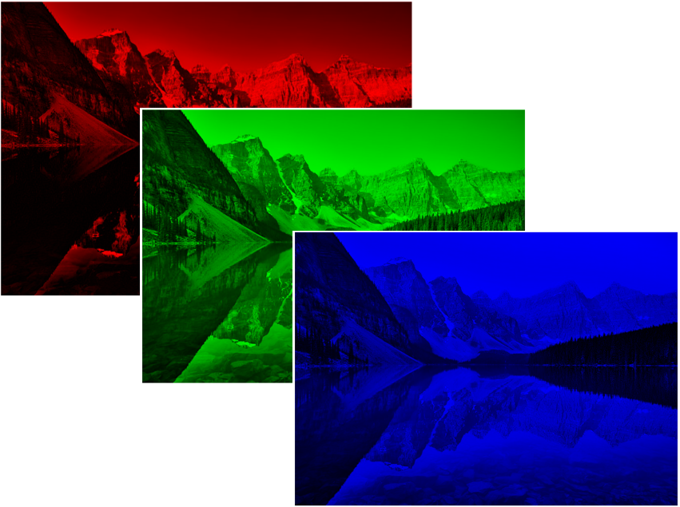
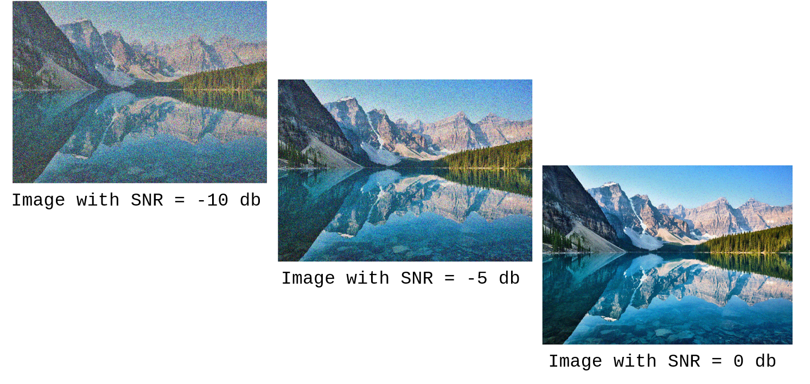

# WIRELESS TRANSMISSION SIMULATION
Wireless transmission of digital signals through noisy medium using Python.

## Instructions to Run the Code

```Python
base_path = "C:\\YOUR\\IMAGE\\LOCATION\\" # put your image location here.
```

In this part, you need to specify the image name.

```Python
i, d, p, h, w, s = read_image(base_path + "YOUR_IMAGE_NAME.jpg") # specify your image name inside your base_path
```

## General Transmission Process



### Signal Conditioning

READ THE IMAGE AND SPLIT INTO **RGB** CHANNELS



We need to convert each pixel into stream of bits.

### DIGITAL-TO-ANALOG Modulation

In this simulation, we will modulate our bit stream using Binary Phase Shift Keying (BPSK)  modulation scheme, where the **0**’s and **1**’s in a binary message are represented by two different phase states in the carrier signal:   `theta = 0°` for binary **1** and `theta = 180°` for binary **0**.



### Noise
Any transmission will pass with some noise. To simulate noise we use `Additive White Gaussian Noise`. [Learn more from Wiki.](https://en.wikipedia.org/wiki/Additive_white_Gaussian_noise)

**Additive** because it is added to any noise that might be intrinsic to the information system.

**White** refers to the idea that it has uniform to power across the frequency band for the information system. It is an analogy to the color white which has uniform emissions at all frequencies in the *visible spectrum*.

**Gaussian** because it has a normal distribution in the time domain with an average time domain value of zero.

### Demodulation & Detection

Demodulation process involves multiplying the recieved signal with carrier.

**Demodulation** – is to convert received analog signal into binary bits
**Detection** – is making decision whether received signal is `0` or `1`

**Bit Error Rate (BER)** is the number of bit errors per unit time.

**BER** = (𝑁𝑢𝑚𝑏𝑒𝑟 𝑜𝑓 𝑐𝑜𝑟𝑟𝑝𝑢𝑡 𝑏𝑖𝑡𝑠) / (T𝑜𝑡𝑎𝑙 𝑛𝑢𝑚𝑏𝑒𝑟 𝑜𝑓 𝑏𝑖𝑡𝑠 𝑝𝑒𝑟 𝑡𝑟𝑎𝑛𝑚𝑖𝑠𝑠𝑖𝑜𝑛)



### Results

Our original image before transmission.


Splitted image into RGB Channels



Recived Image with diffenet signal strength **dB**




## Disclaimer
Currently, I'm a senior student  and it is the first time I'm publishing a simulation on GitHub.

Sorry in advance if the documentation isn't provided in a concise and scientific format.

We all learn from our mistakes :)
"# wireless_transmission_simulation" 
